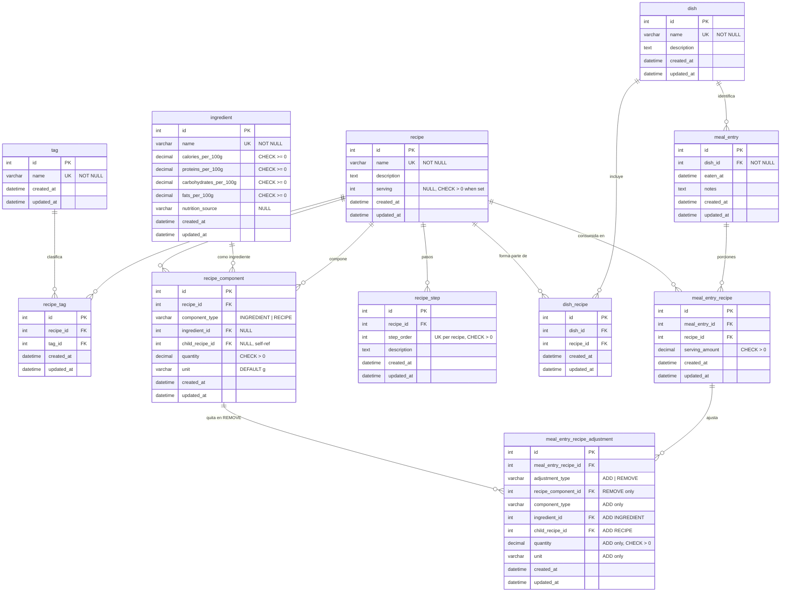

# Database schema (current)

Entity-relationship view of the **implemented** schema. Source of truth: Flyway migration [`V1_0__create_tables.sql`](../src/main/resources/db/migration/V1_0__create_tables.sql).

For planned catalog/metadata changes, see [`schema-evolution-proposal.md`](schema-evolution-proposal.md).

## ER diagram

## Tables by domain

| Domain | Tables | Role |
|--------|--------|------|
| Catalog | `ingredient`, `recipe`, `tag`, `dish` | Core entities; `recipe.serving` optional yield in servings |
| Recipe detail | `recipe_tag`, `recipe_component`, `recipe_step` | Tags, composition (ingredient or sub-recipe), steps |
| Dish | `dish_recipe` | Many-to-many: dish ↔ recipes (template, no portions) |
| Meal log | `meal_entry`, `meal_entry_recipe`, `meal_entry_recipe_adjustment` | Logged meal; required dish label; recipes by serving amount; per-line ADD/REMOVE deltas |

## Meal log — column reference

### `meal_entry`

| Column | Purpose |
|--------|---------|
| `dish_id` | Required label for one-line identification in lists (“Milanesa con puré”). Not enforced against `meal_entry_recipe` rows. |
| `eaten_at` | When the meal was eaten. |
| `notes` | Free text (e.g. “Lunch at home”). |

### `meal_entry_recipe`

| Column | Purpose |
|--------|---------|
| `meal_entry_id` | Parent meal. |
| `recipe_id` | Catalog recipe eaten on this line. |
| `serving_amount` | How many servings of that recipe were consumed, relative to `recipe.serving`. Example: recipe yields 4 servings and you ate 2 → `2.0`. |

No `quantity`/`unit` on this table: portion sizing lives in the recipe; the log only scales by servings.

### `meal_entry_recipe_adjustment`

One row = one ADD or REMOVE against the effective composition of that meal line.

| Column | REMOVE | ADD |
|--------|--------|-----|
| `adjustment_type` | `'REMOVE'` | `'ADD'` |
| `recipe_component_id` | Catalog line to omit | Must be NULL |
| `component_type` | NULL | `'INGREDIENT'` or `'RECIPE'` |
| `ingredient_id` / `child_recipe_id` | NULL | Same rules as `recipe_component` |
| `quantity` / `unit` | NULL | Amount and unit for the extra component |

Application layer should ensure `recipe_component_id` belongs to `meal_entry_recipe.recipe_id` on REMOVE.

## Meal log — use cases

| # | Scenario | Model usage |
|---|----------|-------------|
| 1 | Log lunch at a date/time with a single display name | `meal_entry` + required `dish_id`; create `dish` on the fly if missing |
| 2 | Start from a dish template | Copy `dish_recipe` → `meal_entry_recipe` with default `serving_amount = 1`; user may add/remove recipe lines afterward |
| 3 | Eat more portions, no recipe changes | One `meal_entry_recipe` row; increase `serving_amount` only; no adjustment rows |
| 4 | Omit a catalog ingredient (e.g. milk in mashed potatoes) | `adjustment_type = REMOVE`, `recipe_component_id` = that component row |
| 5 | Add an extra ingredient (e.g. cream) | `adjustment_type = ADD` with `component_type`, reference, `quantity`, `unit` |
| 6 | Same dish name, different actual meals | Same `dish_id` allowed; `meal_entry_recipe` and adjustments may differ per `meal_entry` |
| 7 | Same recipe twice in one meal with different tweaks | Two `meal_entry_recipe` rows (same `recipe_id` allowed); separate adjustment sets |
| 8 | Nutrition for a meal line | Build effective components: catalog `recipe_component` − REMOVE + ADD; compute batch totals; scale by `serving_amount / recipe.serving` when `serving` is set |

**Not in schema (future):** change quantity of an existing component without REMOVE+ADD; reusable catalog “alternatives”; promote a frequent variant to a new `dish` (see evolution proposal).

## Business rules (constraints)

- **`recipe`**: `serving` is nullable (e.g. sub-recipes like sauces). When set, must be `> 0` (`chk_recipe_serving`).
- **`recipe_component`**: `component_type` is `INGREDIENT` or `RECIPE`. Exactly one of `ingredient_id` or `child_recipe_id` must be set, matching the type. A recipe cannot reference itself as `child_recipe_id`.
- **Uniqueness**: `(recipe_id, tag_id)`, `(dish_id, recipe_id)`, `(recipe_id, step_order)`; component rows are unique per recipe and reference (ingredient or child recipe).
- **`meal_entry`**: `dish_id` is required. Actual composition is in `meal_entry_recipe` (+ adjustments); no FK to `dish_recipe`.
- **`meal_entry_recipe`**: `serving_amount > 0`. Deleting a `meal_entry` cascades to recipes and adjustments.
- **`meal_entry_recipe_adjustment`**: REMOVE requires only `recipe_component_id`; ADD mirrors `recipe_component` shape. `recipe_component` delete is RESTRICT if still referenced by a REMOVE row.

## Maintenance

When the schema changes in a new Flyway migration, update this diagram and the meal log sections, or add a short note pointing to the migration that superseded part of the model.
