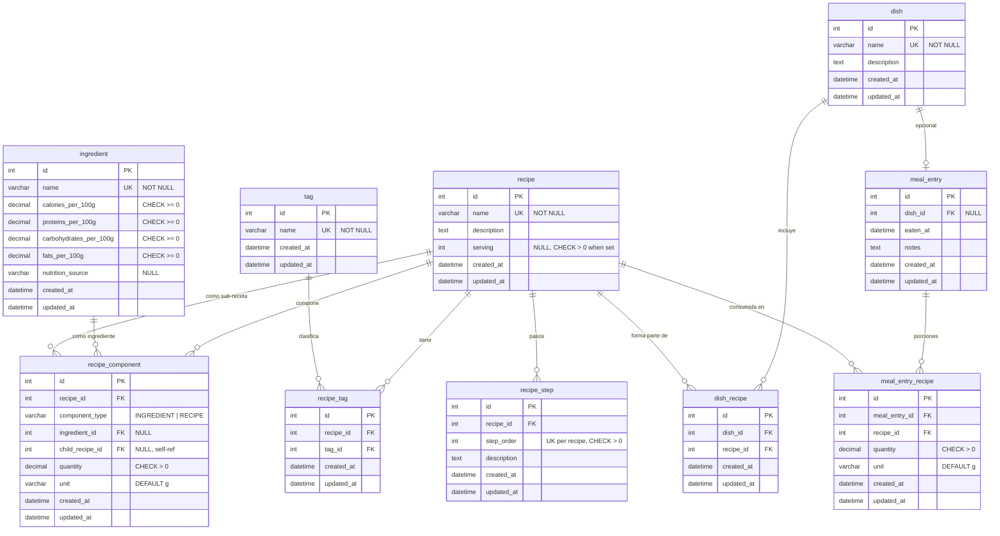

# Database schema (current)

Entity-relationship view of the **implemented** schema. Source of truth: Flyway migration [`V1_0__create_tables.sql`](../src/main/resources/db/migration/V1_0__create_tables.sql).

For planned changes, see [`schema-evolution-proposal.md`](schema-evolution-proposal.md).

## ER diagram

## Tables by domain

| Domain | Tables | Role |
|--------|--------|------|
| Catalog | `ingredient`, `recipe`, `tag`, `dish` | Core entities; `recipe.serving` optional yield in servings |
| Recipe detail | `recipe_tag`, `recipe_component`, `recipe_step` | Tags, composition (ingredient or sub-recipe), steps |
| Dish | `dish_recipe` | Many-to-many: dish ↔ recipes |
| Meal log | `meal_entry`, `meal_entry_recipe` | Logged meal; optional dish; recipes with quantity |

## Business rules (constraints)

- **`recipe`**: `serving` is nullable (e.g. sub-recipes like sauces). When set, must be `> 0` (`chk_recipe_serving`).
- **`recipe_component`**: `component_type` is `INGREDIENT` or `RECIPE`. Exactly one of `ingredient_id` or `child_recipe_id` must be set, matching the type. A recipe cannot reference itself as `child_recipe_id`.
- **Uniqueness**: `(recipe_id, tag_id)`, `(dish_id, recipe_id)`, `(recipe_id, step_order)`; component rows are unique per recipe and reference (ingredient or child recipe).
- **`meal_entry`**: `dish_id` is optional; linked recipes live in `meal_entry_recipe`.

## Maintenance

When the schema changes in a new Flyway migration, update this diagram or add a short note here pointing to the migration that superseded part of the model.
